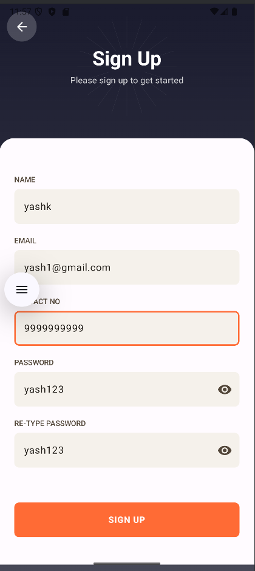
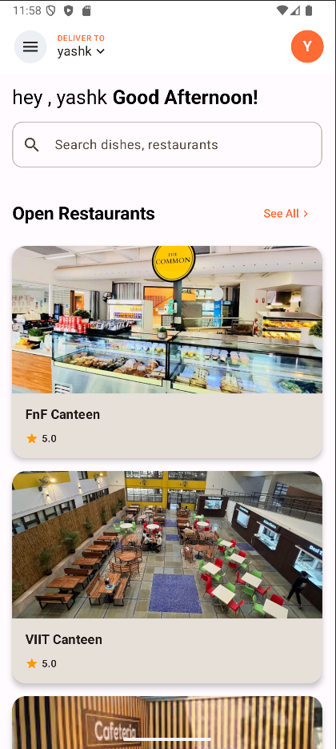
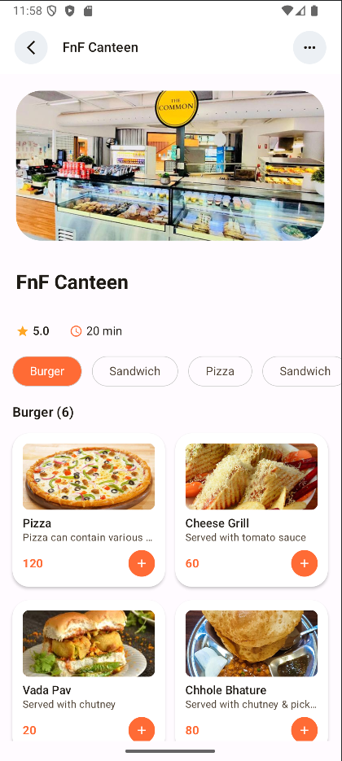
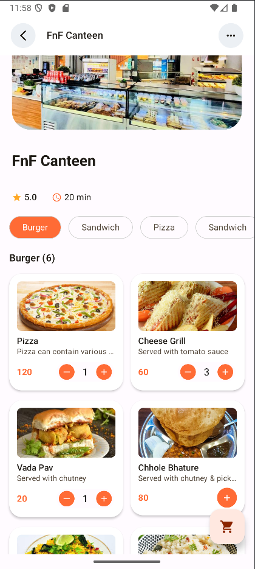
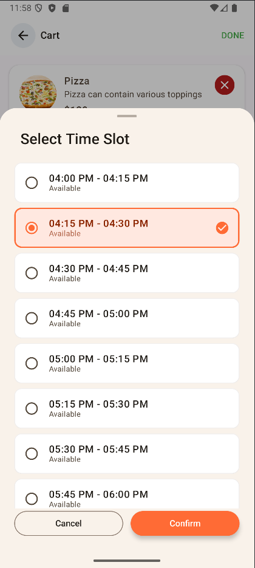
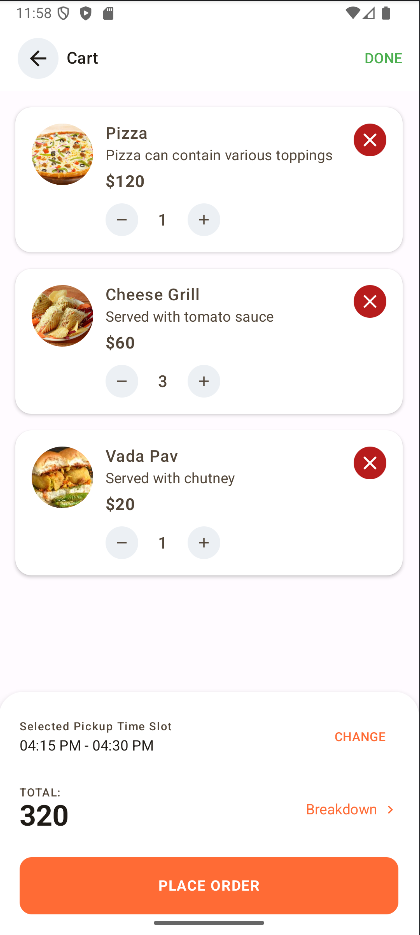

# 🚀 SpeedyServe

SpeedyServe is a **smart pre-ordering platform** designed to solve the problem of **long queues in college canteens**, especially during peak hours. With SpeedyServe, students and staff can **pre-order food**, choose a **preferred time slot**, and simply pick up their meals without waiting.  

The platform is available on both **Web**(for canteen) and **Mobile (Android)**(for users). 

---

## 📖 Table of Contents
- [Features](#-features)
- [Tech Stack](#-tech-stack)
- [Screenshots](#-screenshots)
- [Installation](#-installation)
- [Usage](#-usage)
- [Contributors](#-contributors)
- [License](#-license)

---

## ✨ Features
- 🍔 **Pre-order food** – proorder food and avoid long queues  
- ⏰ **Time-slot booking system** – avoid rush by scheduling pickup times  
- 🔔 **Order notifications** – get real-time updates on order status    
- 🛠️ **Admin dashboard** – canteen staff can manage menu, orders, and slots  
- 🔒 **Secure authentication system** – login/signup for users & admins  
- 📊 **Analytics & reports** – track peak hours, popular dishes, and revenue  

---

## 🛠 Tech Stack
**Frontend (Web):**
- React.js  

**Frontend (App):**
- Android (Jetpack Compose)  

**Backend:**
- Node.js   

**Database:**
- MongoDB  

**Deployment & Hosting:**
- Vercel 
- Render

---

## 📷 Screenshots

### 📱 Mobile App
| SignIn Screen | SignUp Screen | Home Screen |
|-------------|-----------------|---------|
|   |  |  |

| Menu Screen | Menu Screen | Cart Screen |
|-------------|-----------------|---------|
|   |  |  |

| Timeslot Screen | Timeslot Screen | 
|-------------|-----------------|
|   |  | 

### 💻 Web App
| Dashboard | Service Page | Admin Panel |
|-----------|--------------|-------------|
|  |  |  |

---

